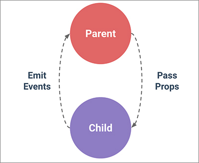

<!---
marp: true
theme: uncover
class: invert
headingDivider: 2
paginate: true
header: '&e tech'
footer: 'Created with [Marp](https://marp.app) and [Github Pages](https://pages.github.com)'
backgroundImage: 'img/react-logo.svg'
style: |
  section {
    font-size: 30px;
    text-align: left;
  }

  section code {
    font-size: 30px;
  }

  section ul,
  section ol,
  section img {
    margin-left: 0;
  }

  section header {
    height: 100px;
    width: 100px;
    left: auto;
    right: 40px;
    background-color: #dfddd7;
    background-size: contain;
    -webkit-mask-image: url(img/and-e-tech-logo-300.svg);
    mask-image: url(img/and-e-tech-logo-300.svg);
    -webkit-mask-repeat: no-repeat;
    mask-repeat: no-repeat;
    -webkit-mask-size: contain;
    mask-size: contain;
    text-indent: -99999999px
  }

  .columns {
    display: grid;
    grid-template-columns: repeat(2, minmax(0, 1fr));
    gap: 1rem;
  }
--->

# React Workshop

Intro to React

# What is react?

- At it’s most basic, React is JS library for creating UIs by Facebook
- React is a JavaScript view layer
- Unlike MVC frameworks it doesn’t have
  - controllers
  - models

# What do we mean by view layer?

- React renders JSX as HTML
- React interpolates data into HTML using JSX
- Event handlers can be bound to UI events
- React redraws the DOM in response to events
- Where we get our data and what those UI events trigger is up to us
- All of these things are the UI or view layer

# A basic React app

- HTML page with a root react element
- Include react source
- Your custom react code

```html
<div id="root"></div>

<script src="path/to/react.js" />
<script src="path/to/react-dom.js" />

<script>
  const root = ReactDOM.createRoot(document.getElementById('root'));
  root.render("Hello, world!");
</script>
```

<!---
No need for pipelines
No need for transpilers
Just plain and simple react
Probably not how we would build a large app
--->

# What is JSX?

- JSX is a templating tool for Javascript
- It allows us to write something similar to HTML (but not quite the same!)
- It allows us to interpolate JavaScript using {}
- It allows us to bind data or functions to JSX attributes
- It allows us to bind UI events

```jsx
const helloWorldText = "Hello World!";
root.render(<h1>{helloWorldText}</h1>);
```

<!---
note onClick not on-click
JSX is not the only templating tool for react - we could use handlebars for example
talk about how other frameworks handle templating
So where do we write our JSX
--->

# What is a component?

<div class="columns">

- Components are reusable independent bits of code
- Components can be as simple as a function but we can also use classes
- Components can accept props as an argument
- Components can hold their own state
- Components return HTML

<div>

```jsx
function HelloWorldComponent () {
  return <p>Hello world!</p>;
}
```

```jsx
class HelloWorldComponent extends React.Component {
  render() {
    return <p>Hello world!</p>;
  }
}
```

```jsx
root.render(<HelloWorldComponent />);
```

</div>
</div>

<!---
Ideally we don’t use classes. react considers classes to be outdated and with the introduction of hooks, functional components can use state. React docs here https://beta.reactjs.org/reference/react/Component
--->

# What are props?

<div class="columns">

- Props are values we pass to components
- Props can be data or functions
- Props are immutable
- When new props are passed to a react component, the component will re render

<div>

```jsx
function HelloWorldComponent (props) {
  return <h1>Hello {props.username}!</h1>;
}
```

```jsx
class HelloWorldComponent extends React.Component {
  render(props) {
    return <p>Hello {props.username}!</p>;
  }
}
```

```jsx
<HelloWorldComponent username="Andy" />
```

</div>
</div>

<!---
talk about render and object instances in class component
--->

# propTypes

<div class="columns">

- PropTypes checks the type of props
- We can validate the shape of our props
- We can validate the presence of props

```jsx
import PropTypes from 'prop-types'

function HelloWorldComponent (props) {
  return <h1>Hello {props.username}!</h1>;
}

HelloWorldComponent.propTypes = {
  username: PropTypes.string.isRequired
}
```

</div>

<!---
Mention Typescript and advantages
--->

# defaultProps

<div class="columns">

- defaultProps allows us to set defaults
- defaults must adhere to the type checking

```jsx
import PropTypes from 'prop-types'

function HelloWorldComponent (props) {
  return <h1>{props.salutation} {props.username}!</h1>;
}

HelloWorldComponent.defaultProps = {
  salutation: 'Hello'
}
```

</div>

# Lots of small components

<div class="columns">

- We can call components inside other components
- We can pass data down to other components as props
- We can forward all of the parent component’s props to child component using `...props`

```jsx
function SayHello (props) {
  return <p>Hello {props.username}!</p>;
}

function HelloWorldComponent (props) {
  return (
    <div>
      <SayHello username={props.username} />
      <SayHello ...props />
    </div>
  )
}
```
</div>

# Component children

<div class="columns">

- Sometimes we want to wrap components in another component
- We can use the special props.children  to create a wrapper component

<div>

```jsx
function PopUpWindow (props) {
  return (
    <div className="pop-up">
      {props.children}
    </div>
  );
}

function SayHello (props) {
  return <p>Hello {props.username}!</p>;
}

const HelloWorldComponent = () => {
  return (
    <PopUpWindow>
      <SayHello username="Andy" />
    </PopUpWindow>
  );
}
```

</div>
</div>

# What are events?

<div class="columns">

- Events are triggered by user interactions (button clicks, input changes etc)
- Events can be bound to functions (event handlers)
- Event handlers can modify state, or trigger ui changes

```jsx
function HelloWorldComponent () {
  function onClickHandler (event) {
    alert('Hello world');
  }

  return (
    <button onClick={onClickHandler}>
      Say hello
    </button>
  );
}
```

</div>

<!---
point out that all event handlers take an event
we could pass an event handler as a prop
--->

# What is state?

<style scoped>
  section ul,
  section ul code {
    font-size: 26px;
  }
</style>


<div class="columns">

- State is data internal to a component
- State is immutable
- Modifying state re renders the component
- State is accessed and modified in functional components using the `useState` hook
- State is accessed in a class components using `this.state`
- State is modified in a class components using `this.setState`

```jsx
import React, {useState} from "react";

function HelloWorldComponent () {
  const [username, setUsername] = useState("Andy");

  function setUsernameHandler (event) {
    setUsername(event.target.value);
  }

  return (
    <div>
      <p>Hello {username}!</p>
      <input onChange={setUsernameHandler} value={username} />
    </div>
  );
}
```

</div>

<!---
We haven’t talked about hooks yet - this is advanced but we can touch on it here
when we talk about mutability js allows us to mutate but we shouldnt
--->

# Why not mutate state?

<div class="columns">

- It’s simpler to rebuild new state than mutate old state
- It’s easier to detect that the entire state has changed than to detect if some part of the state has changed
- If it’s easy to detect if state has changed, it’s easy to determine when components re render
- Modifying state directly will not re render the component

```jsx
function HelloWorldComponent () {
  let [username, setUsername] = useState("Andy");

  function setUsernameHandler (event) {
    username = event.target.value;
  }

  ...
}
```

</div>

<!---
You cannot modify state this way in a functional component you can only use hooks which avoid this problem
--->

# Data down, actions up!

<style scoped>
  section ul {
    font-size: 22px;
  }

  section img {
    width: 100%;
  }
</style>

<div class="columns">

- Data down
  - data comes into a component via props
  - when props change, the component is re rendered
- Actions up
  - Callback functions can be injected into a component via props
  - Component calls a callback function using React DOM events
  - Callback function modifies a value outside the component
  - the modified value is passed to the child as a prop component causing a re render



</div>
